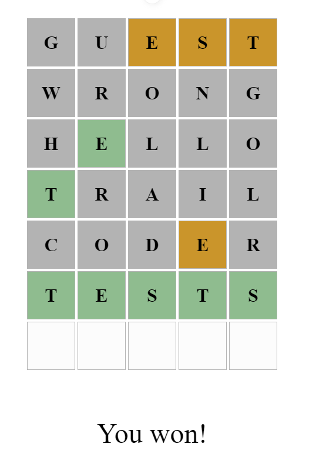

# Wordle Clone Project

## Overview
This project is a clone of the popular simple game Wordle, where the goal is to guess a hidden word. Players have 6 attempts to guess the correct word.




## Game Rules
- The player has 6 attempts to guess the word of the day.
- Following the rules of the original Wordle game:
  - Correct letters in the correct position are highlighted.
  - Correct letters in the wrong position are highlighted differently.
  - Incorrect letters are marked as such.

## Project Goals
The main objective of this project is to gain knowledge in the field of unit testing and component testing using the Vitest and Cypress libraries.


## Testing
- The project is fully covered by unit tests.
- Comprehensive component testing to ensure the reliability and accuracy of the game logic and user interface.

## Technologies Used
- Vue.js
- TypeScript
- Vitest for unit testing
- Cypress for component testing


## Recommended IDE Setup

[VSCode](https://code.visualstudio.com/) + [Volar](https://marketplace.visualstudio.com/items?itemName=Vue.volar) (and disable Vetur).

## Type Support for `.vue` Imports in TS

TypeScript cannot handle type information for `.vue` imports by default, so we replace the `tsc` CLI with `vue-tsc` for type checking. In editors, we need [Volar](https://marketplace.visualstudio.com/items?itemName=Vue.volar) to make the TypeScript language service aware of `.vue` types.

## Customize configuration

See [Vite Configuration Reference](https://vitejs.dev/config/).

## Project Setup

```sh
npm install
```


### Compile and Hot-Reload for Development

```sh
npm run dev
```

### Type-Check, Compile and Minify for Production

```sh
npm run build
```

### Run Unit Tests with [Vitest](https://vitest.dev/)

```sh
npm run test
```

### Run E2E Tests with [Cypress](https://www.cypress.io/)

```sh
npm run test:e2e
```
